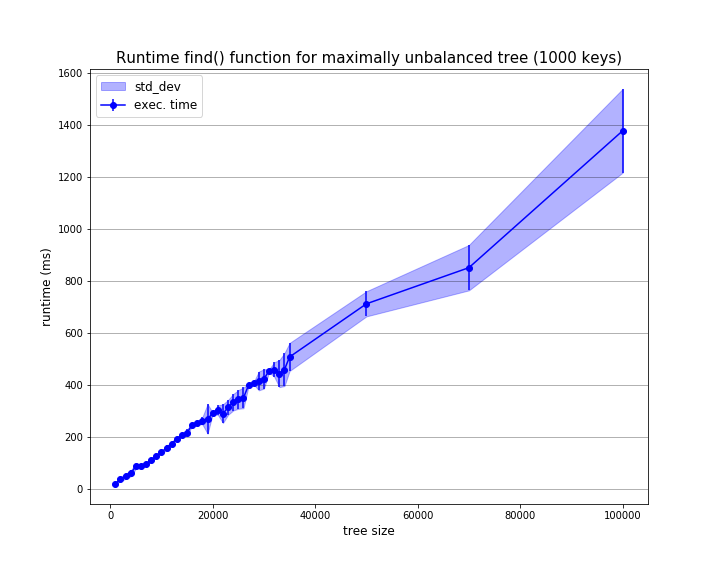
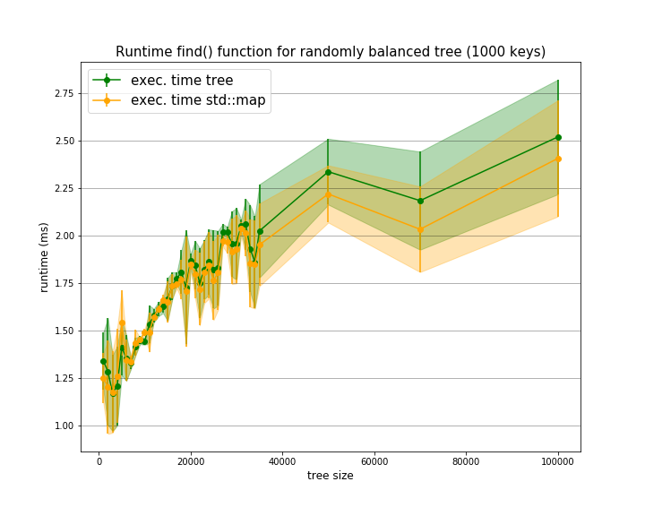

### BINARY SEARCH TREE

We implement a template binary search tree (BST) ordered according to a template comparison operator.

#### Description of folder and Makefile 

The repository contains:

- header file bst.h containing the implementations of the class bst, iterator and of the structure node;

- main file bst.cc containing both the tests for the various functionality of the classes, and the relevant test for banchmarking.

- file Makefile for fast compilation (and run) of the program.

- Jupyter Notebook graphics.ipnb used for plotting the results of the benchmark;

- folder results containing the results obtained on the cluster c3HPC. 

     

If the folder structure is mantained, the following instructions can be used for compilation (all with flags -Wall -Wextra -Wpedantic -O3):

- ```make``` : compiles the filed bst.cc with "empty" main function after including bst.h;
- ```make test``` : compiles the filed bst.cc including bst.h with flag -DTEST. In this case the main function containing running the main tests of the functionalities and structures implemented;
- ```make memory``` (after running ```make test```): runs the executable ./bst.x of the test checking for memory-leeks using valgrind;
- ```make bench``` : produce executable ./bst.x that must be called by   ``` ./bst.x N N_keys``` for N and N_keys size_t values (with N=>N_keys) for performing benchmark for the search of N_keys value on a tree with N random keys inserted (more detailed information in the following);
- ```make clean```: clears outputs. Must be called before make test and make bench to restart from scratch.

#### Main design choices

Our construction of the binary tree builds upon the one of linked list, following essentially the idea that a totally unbalanced binary tree is in fact a linked list. The very new ingredient is the presence of a naked pointer ```_upper``` in the structure **node**. This pointer is functional to the construction of the BST: the ```_upper``` node of the tree points to ```nullpointer```, and then ```_upper``` points to the parent node if added on the left and it points at the same location of the ```_upper``` of the parent when added on the right. This decision influences the all construction of the classes **bst** and **iterator** and their functions. Naively this choice has been taken as it seems to lead to less amount of checks when constructing the traversal ordering of the tree, but this might depend on the balancing properties of the tree.

There are then a some "design choices" that are mainly related to the short time of implementation and that eventually should or could be modified: 

- **node** is a structure in order to avoid privacy problems and having to implement helper functions, but this ultimately should become a proper class;
- for simplicity we kept the **iterator** class inside the class **bst**  to make it resemble the case of the linked list but also this should become an independent class;
- we decided to avoid the semantic that uses further templates to write at once cont l-value and r-value valued functions.    

#### Comments on the main functions

We focus briefly only on few main functions:

- operator++ of the class iterator: we start from the function that mostly influenced our design. If a node has a right child we follow a standard procedure, otherwise we just return the ```_upper``` node.
- find(k) in class bst: we start from the root and run down left or right in the tree by comparing k to key value of the node until it is possible. In this case whether we found the key and we return it, or we return the end() of the iterator. 
- insert() in class bst: we proceed similarly to find(). In this case we stop when we found a node for which our key can be inserted on the left or on the right and we insert, or if we found the same key we are trying to insert.
- copy constructor: given our design it is NOT sufficient to make a unique pointer starting from the old root, as this would force the _upper nodes to point to the old tree thus resulting in a shallow copy. We thus proceed by recursion inserting the key corresponding to the node and copying the left and right nodes. 

#### Benchmark

In order to avoid using our up and running but terribly slow recursive balance() function we proceed as follows for our benchmark: 

- we feed a tree ```unmbalanced_tree``` integers from 1 to N, so that it is maximally unbalanced (=linked list);

- we fill a tree ```random_tree``` with a random shuffle of the same integers;

- we fill a ```std::map m``` the same random shuffle of the integers;
- we look-up for N_keys=1000 randomly selected keys among the ones of our trees/map.

Even if ```random_tree``` is almost surely not perfectly balanced, it will be much more balanced than ```unbalanced_tree```. This can be observed in the plots. We notice that ```std::map``` generally outperforms our look-up method but the performances are very similar. The linear nature of the maximally unbalanced case, and the logarithmic behaviour for the ```random_tree``` can be observed especially for large number of nodes. 






​    